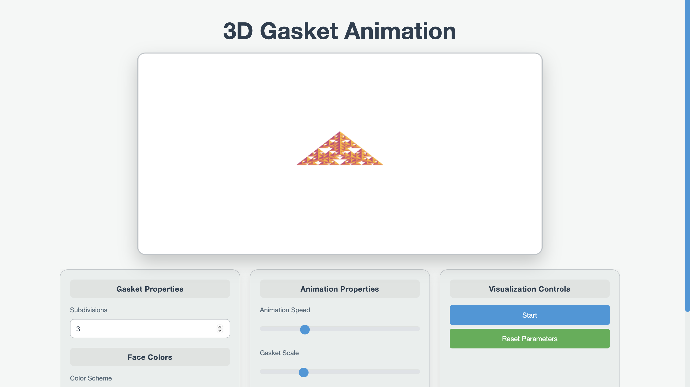

# 3D Gasket TV Ident Animation

<a href="https://Dershyani.github.io/TV-Ident/" target="_blank">
  
</a>

Click on the image above to visit the project.

## Project Overview

The **3D Gasket TV Ident Animation** showcases interactive 3D transformations of a gasket shape, featuring rotations, scaling, translations, and color transitions with customizable user controls.

## Main Features

- **Initial Rotations:** Gasket rotates 180° right and left, then returns to its original position.
- **Enlargement:** Gasket grows and shrinks back to its original size.
- **Translation:** The gasket moves according to the user, including options for:
  - **No rotation** (default)
  - **Rotation around X-axis**
  - **Rotation around Y-axis**
  - **Rotation around Z-axis**

## Additional Features

- **Subdivision:** Adjusts tetrahedron subdivision level via `NumTimesToSubdivide` slider.
- **Colour Properties:** Choose from custom, monochrome, or pastel color schemes.
- **Animation Speed:** Control animation speed from 0.5 to 2.0 (default: 0.9).
- **Animation Scale:** Adjust scale between 0.3 and 3.0 (default: 1.0).
- **Start/Stop Button:** Click "Start" to begin the animation, "Stop" to pause, and "Start" again to resume.
- **Reset Button:** Resets animation to its original state and stops any running animations.

## Installation & Setup
**1. Clone the Repository**
   ```bash
     git clone https://github.com/your-username/3D-Gasket-TV-Ident.git
  ```
**2.** **Navigate to the project directory**
  ```bash
    cd 3D-Gasket-TV-Ident
  ```
**3. Open in a Web Browser** <br>
Simply open ```gasket4.html``` in any modern browser (Chrome, Firefox, Edge).

**4. Customize the Animation**
  - Use the built-in UI to:

  - Adjust the number of iterations

  - Control animation speed

  - Change gasket colors

  - Start/Stop animations with buttons & keyboard controls

## Technologies Used
  - WebGL (Rendering)
  
  - JavaScript (Animation & Interactivity)
  
  - HTML & CSS (User Interface)
    
  - Angel’s 3D Gasket Algorithm (Base structure)

## Usage Instructions
  1. Open gasket4.html in a browser.
  
  2. Use sliders and menus to adjust settings.
  
  3. Press Start Animation to begin.
  
  4. Use buttons or keyboard keys to interact.
  
  5. Click Stop Animation to halt movement.
